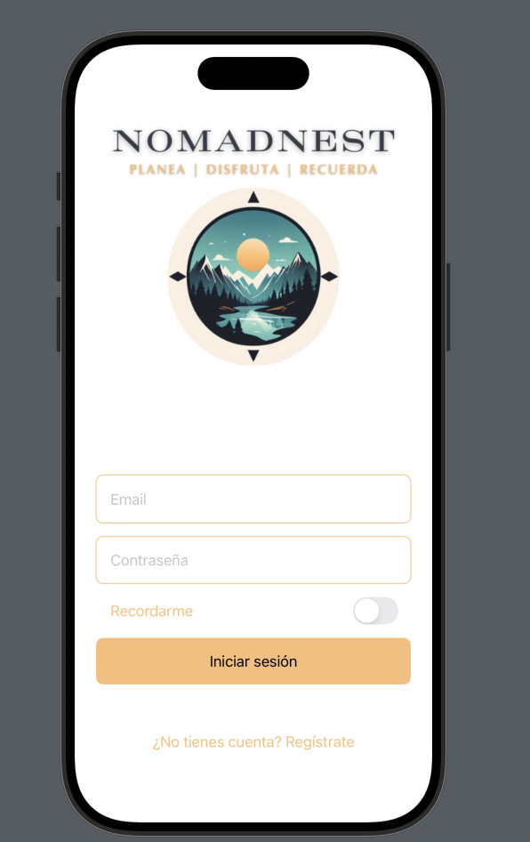
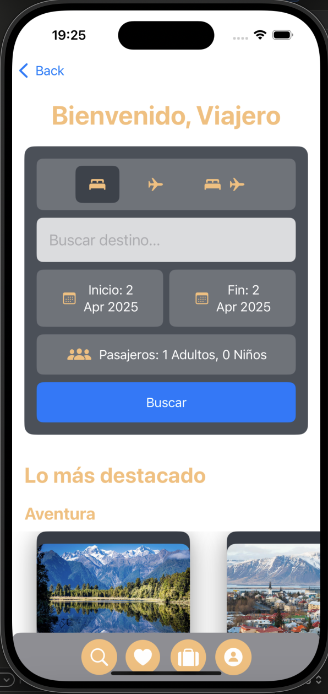
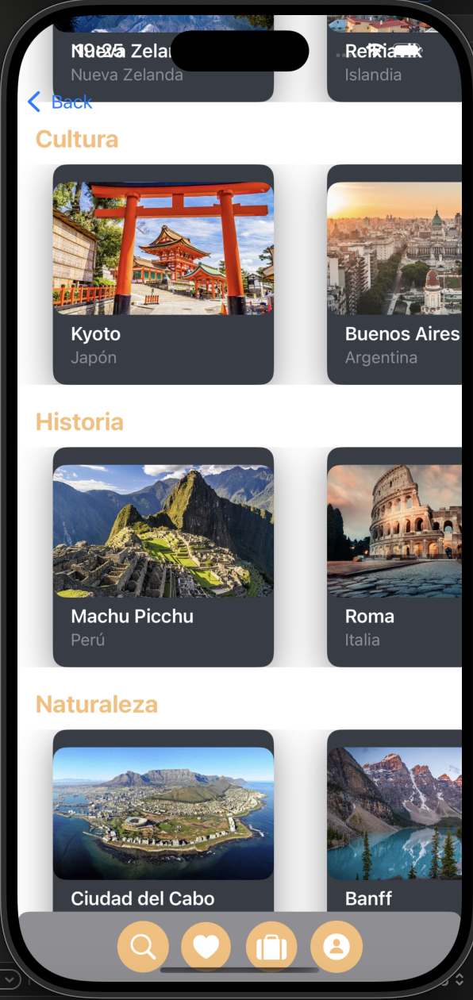
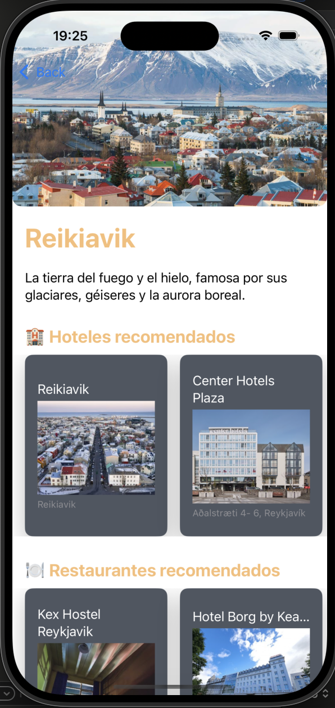
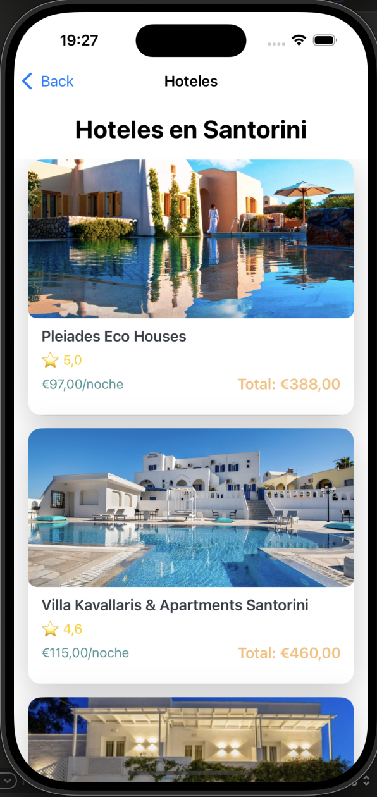

# Hola 👋, Soy Rocío

## iOS Developer

### Sobre mí
🚀 Buscando una oportunidad como **Desarrolladora de aplicaciones móviles**.  
🤝 Busco colaborar en proyectos de **Desarrollo de iOS**.  
💬 Pregúntame sobre **Swift, SwiftUI, iOS, Combine, UIKit, MVVM, CoreData**.  

### 📫 Contáctame:
  

---

### 📱 Proyectos destacados

# 📱 Nomad Nest

## 🏕️ Aplicación de viajes para aventureros

Nomad Nest es una aplicación móvil diseñada para viajeros que buscan experiencias únicas y aventuras en distintos destinos del mundo.

---

## 📸 Capturas de pantalla

### 🔐 Pantalla de Login

Pantalla de inicio de sesión donde los usuarios pueden acceder a su cuenta o registrarse para empezar a planear sus viajes.

### 🏠 Pantalla de Inicio

La pantalla principal da la bienvenida al usuario y le permite buscar destinos, seleccionar fechas y configurar el número de pasajeros.

### 🌍 Destinos Destacados

Muestra una lista de destinos populares organizados en categorías como **Aventura, Cultura, Historia y Naturaleza**.

### 🔍 Exploración de Lugares
, (Captura de pantalla 2025-04-02 a las 19.27.00.png)
Aquí el usuario puede ver detalles de cada destino con imágenes llamativas y descripciones.

### 🏨 Hoteles Encontrados

Lista de hoteles disponibles en la ciudad seleccionada, con precios y opciones para reservar.

---

## 🚀 Tecnologías utilizadas
- **Swift & SwiftUI** para el desarrollo nativo en iOS
- **MVVM** como arquitectura de la app
- **UIKit y Combine** para una experiencia fluida

Si te gusta el proyecto, ¡no dudes en darme una ⭐ en GitHub! 😊

<!--
**Rociomartos29/RocioMartos29** is a ✨ _special_ ✨ repository because its `README.md` (this file) appears on your GitHub profile.

Here are some ideas to get you started:

- 🔭 I’m currently working on ...
- 🌱 I’m currently learning ...
- 👯 I’m looking to collaborate on ...
- 🤔 I’m looking for help with ...
- 💬 Ask me about ...
- 📫 How to reach me: ...
- 😄 Pronouns: ...
- ⚡ Fun fact: ...
-->
